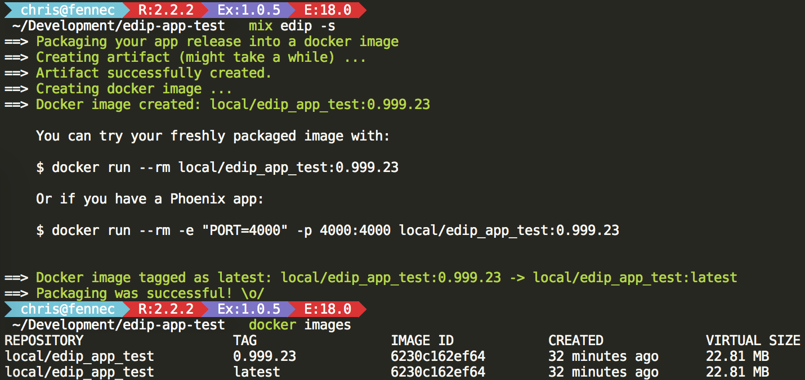

# Elixir Docker Image Packager (EDIP)

Attempt to create the possibly smallest Docker image for an Elixir release.

----

Use it in your Elixir project with [mix-edip](https://github.com/asaaki/mix-edip),
a mix task to easily package your release image.

_(Note: This repo is for documentation only.)_

----

<!--
  TOC generaged with doctoc: `npm install -g doctoc`

    $ doctoc README.md --github --maxlevel 4 --title '## TOC'

-->
<!-- START doctoc generated TOC please keep comment here to allow auto update -->
<!-- DON'T EDIT THIS SECTION, INSTEAD RE-RUN doctoc TO UPDATE -->
## TOC

- [Showdown](#showdown)
- [Prerequisites](#prerequisites)
- [Usage](#usage)
  - [Project dependency](#project-dependency)
  - [Mix archive installation](#mix-archive-installation)
  - [Without any mix task (CI environment)](#without-any-mix-task-ci-environment)
  - [Test](#test)
- [How it works](#how-it-works)
  - [Step 0: Downloading the EDIP tool](#step-0-downloading-the-edip-tool)
  - [Step 1: Creating the artifact (tarball archive)](#step-1-creating-the-artifact-tarball-archive)
  - [Step 2: Creating the final docker image](#step-2-creating-the-final-docker-image)
- [Caveats](#caveats)
- [FAQ](#faq)
  - [Why?](#why)
  - [Does it work for Phoenix apps?](#does-it-work-for-phoenix-apps)
  - [How different is it from ...?](#how-different-is-it-from-)
    - [msaraiva's "Erlang/Elixir on Alpine Linux"](#msaraivas-erlangelixir-on-alpine-linux)
  - [Is it free?](#is-it-free)

<!-- END doctoc generated TOC please keep comment here to allow auto update -->

## Showdown



## Prerequisites

Next to your Elixir application you need _docker_ and most likely _mix-edip_.
Also do not forget to add _exrm_ as a dependency in your project.

## Usage

Either add [`mix-edip`](https://github.com/asaaki/mix-edip) as a dependency in your Elixir project or
install the mix archive.

In both cases you definitely need to add `exrm` as a project dependency!

### Project dependency

In mix.exs:

```elixir
defp deps do
  [
    {:exrm, "~> 0.18"},
    {:edip, "~> 0.3"}
  ]
end
```

Then run:

```shell
mix deps.get edip && mix deps.compile edip
```

### Mix archive installation

```shell
mix archive.install \
  https://github.com/asaaki/mix-edip/releases/download/v0.3.0/edip-0.3.0.ez
```

Do not forget to add `exrm` to your project (in mix.exs):

```elixir
defp deps do
  [
    {:exrm, "~> 0.18"}
  ]
end
```

### Without any mix task (CI environment)

If you want to keep your CI build setup clean, you do not neccessarily have to install Elixir and _mix-edip_ at all.

The docker commands are pretty simple.
The information for application/release name and version might be less trivial.
(If your CI server/service supports useful ENV vars you should use them.)

**artifact creation:**

```shell
docker run --rm \
  -v /path/to/my_awesome_app:/source \
  -v /path/to/my_awesome_app/tarballs:/stage/tarballs \
  asaaki/edip-tool:0.3.0
```

**image creation:**

```shell
cat /path/to/my_awesome_app/tarballs/my_awesome_app-0.1.0.tar.gz | \
  docker import \
    --change 'CMD trap exit TERM; /app/bin/my_awesome_app foreground & wait' - \
    local/my_awesome_app:0.1.0
```

**tagging with "latest":**

```shell
docker tag --force local/my_awesome_app:0.1.0 local/my_awesome_app:latest
```

### Test

Start the app in foreground mode:

```shell
docker run --rm -it local/my_awesome_app
```

If everything went well, your release should be up and running now.

## How it works

The whole build/packaging process happens in a Docker container.
Therefore the only system dependency next to Elixir (for running the mix task) is _docker_ itself.

(If you plan to use EDIP tool in a CI environment you can manually trigger the artifact and image creation,
then no Elixir in the host environment of the CI build is needed.)

### Step 0: Downloading the EDIP tool

This is just a docker image.

The setup of it can be found at [asaaki/docker-images: dockerfiles/edip-tool/0.3.0](https://github.com/asaaki/docker-images/tree/master/dockerfiles/edip-tool/0.3.0).

At Docker Hub: <https://hub.docker.com/r/asaaki/edip-tool/>

Because nesting of docker containers can be sometimes quite cumbersome, we split the packaging into two steps, so we can
stay on the host were the docker daemon is running.

_If you run everything already within containers keep in mind to properly propagate the docker environment with
`--privileged` and volumes for the docker executable and the socket._

### Step 1: Creating the artifact (tarball archive)

In the first step only the so-called artifact is created. This is a tarball archive containing the application release
and its system dependencies (because the Erlang VM is not statically linked and therefore needs some libraries).

### Step 2: Creating the final docker image

With the artifact from the previous step we can simply create a docker image of it.

This is a pretty easy step (utilizing _docker import_).

## Caveats

Beware of hex packages which have dependencies to the system (shared libraries or tools/binaries).
If [step 1](#step-1-creating-the-artifact-tarball-archive) fails then it's probably because of missing stuff.

Because the docker image is based on an _Alpine Linux_ it also might be possible that not everything you would need
is available. Sometimes it can be manually compiled, as long as the library or application has no mandatory dependency
to _glibc_ (Alpine is using _musl libc_ instead).

## FAQ

### Why?

Not just for fun, but to save my sanity by not using overly huge, crazily humongous, tremendously gigantic Ubuntu images.*

There is no need for custom application images which reach the 1 GB mark.

And there is no need for images with risky and unnecessary cruft in it.

_*) Yes, I know, the Ubuntu base image is less than 200 MB, but when you start building your custom image onto it,
then it will quickly grow as hell even if you try to be careful._

### Does it work for Phoenix apps?

If you ignore the static asset compilation step, then yes, it does.
(You can adjust the _package/Makefile.app_ to your needs.)

After a successful build you can test it like this:

```shell
docker run --rm -e "PORT=4000" -p 4000:4000 local/release-image
```

You need to set the `PORT` environment variable, otherwise the app will just crash (only in Phoenix's default config).

### How different is it from ...?

I'm glad you asked! _(And if you find similar projects, point me to them; I'd like to have a look at them, too.)_

#### msaraiva's "Erlang/Elixir on Alpine Linux"

Under [msaraiva/alpine-erlang](https://github.com/msaraiva/alpine-erlang) you'll find a pretty good guide on how to
build pretty small images/containers for your Erlang or Elixir application. Yes, you've read it correctly, I said
_application_, not _release_.

Of course, there is an example for a Phoenix app with exrm, but unfortunatelly it requires dependencies on your host.
I'd like to avoid or at least to minimalize this burden. While in development of your application, you don't care so
much about this downside, but I think here more about CI/CD (continuous integration/deployment).

The other example ["Hello world (compilation inside the container)"](https://github.com/msaraiva/alpine-erlang#-hello-world-compilation-inside-the-container)
is more the flavor of build process I'd like to see. I think this is the much better approach we should aim for.

When you try this and inspect the container content, you will notice some differences from this project:

- the source code is visible
- there are still tools present which are not needed (like _apk_)

In conclusion: Either you have a bit crufty image or a crufty system. Mostly this is not a big deal, but was never my
goal.

### Is it free?

_[Of course it is!](./LICENSE)_
